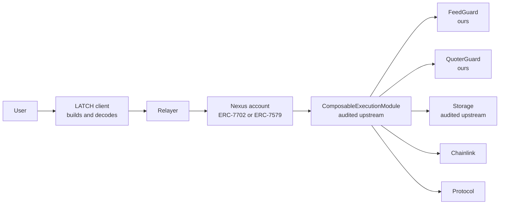

# LATCH

## The pitch

**LATCH is an ERC-8211 execution layer for Biconomy Nexus smart accounts on Base Sepolia.** Users sign
a declarative intent whose parameters resolve on-chain at execution; every resolved value is gated by an
inline constraint, and every oracle-derived value is additionally gated by a freshness check enforced
inside the same atomic batch. The contribution is not the batch encoding — that is
[ERC-8211](https://github.com/ethereum/ERCs/pull/1638), a Standards Track draft authored by Biconomy
with the Ethereum Foundation — but four verifiable components: `FeedGuard`, which makes relative oracle
staleness expressible as a predicate the spec cannot express; `QuoterGuard`, which realises runtime
slippage arithmetic the spec does not contain; `FailSafeExecutor`, which adds opt-in partial-failure
semantics without modifying the audited engine; and a decoder that renders the signed batch as an
auditable plan.

## The problem

ERC-4337 and EIP-5792 froze every parameter of a batched transaction at signing time. That breaks the
flows that matter most in DeFi, because they are all the same shape: **step *n* consumes step *n-1*'s
output.**

| Flow | What breaks |
|---|---|
| Swap then supply | The deposit amount depends on price impact. The swap returns `0.0495 WETH`; the signature says `0.05` |
| Withdraw then bridge | The bridge amount depends on an accruing share rate. The signature says `500`; the vault returns `487.3` |
| Repay then borrow | The collateral ratio depends on a price that moved since signing |
| Sweep the balance | Gas costs are unknown at signing, so a literal amount always leaves dust |

The two available workarounds are both bad. Sign each step separately, which means multiple signatures
and a race window between them. Or deploy a bespoke executor contract per flow, which means a new audit
surface every time the flow changes.

ERC-8211 fixes the first problem in the encoding: parameters declare a **fetcher** — how to obtain the
value at execution — and the value is resolved on-chain immediately before the call.

## What ERC-8211 actually provides

Verified against the audited reference implementation, 2026-10-02. Full detail in
[docs/02-erc8211-spec-notes.md](docs/02-erc8211-spec-notes.md).

Three primitives, one encoding:

| Primitive | Mechanism |
|---|---|
| Runtime parameter injection | Fetchers `RAW_BYTES`, `STATIC_CALL`, `BALANCE` |
| Inline constraints | `EQ`, `GTE`, `LTE`, `IN`, `GTE_SIGNED`, `LTE_SIGNED`, `IN_SIGNED`, `OR`, `SKIP` |
| Cross-entry context | A `Storage` contract carrying captured values between entries |

The pipeline per entry is normative: resolve inputs, validate constraints, route and assemble, execute,
capture outputs. An entry with `target == address(0)` makes no call — it is a pure predicate, a boolean
gate on chain state.

This is genuinely good design. Batch execution becomes a program with assertions between its steps rather
than a hopeful script.

## Where the spec stops, and what we built

The spec has a deliberate boundary, and it is the boundary LATCH lives on.

**Constraint bounds are static literals chosen at signing time.** `_checkConstraint` compares a
resolved 32-byte word against a fixed `referenceData` payload. Nothing in the pipeline can read
`block.timestamp`, and `InputParam` has no expression field.

Three consequences, and three components:

| Gap | Why it is a gap | LATCH component |
|---|---|---|
| `block.timestamp - updatedAt <= maxStaleness` is inexpressible | Bounds are literals. Nothing sees the clock | **`FeedGuard`** |
| `price * (1 - slippage)` is inexpressible | No arithmetic anywhere in the encoding | **`QuoterGuard`** |
| Batches cannot partially fail | Strictly atomic, and upstream declined to add try semantics | **`FailSafeExecutor`** |
| A signed batch is unreadable | Raw ABI tuples | **Batch decoder** |

### `FeedGuard`

A single view contract reducing freshness to one word:

```solidity
function isFresh(address aggregator, uint256 maxStaleness) external view returns (uint256 ok);
```

Gated with `constraint: { eq: 1n }`. `EQ` rather than `GTE`, so a return-type change fails closed. On
Base Sepolia, ETH/USD is `0x4aDC67696bA383F43DD60A9e78F2C97Fbbfc7cb1` with a 1200-second heartbeat, so
`1200` is the default `maxStaleness`.

It also rejects zero answers, future timestamps, and rounds where `answeredInRound < roundId`. It holds
no funds, has no admin functions, and writes no state. See
[docs/04](docs/04-constraints-and-oracles.md).

### `QuoterGuard`

```solidity
function minAmountOut(address quoter, address router, address tokenIn, address tokenOut,
                      uint256 amountIn, uint24 fee, uint256 slippageBps) external view returns (uint256);
```

`minOut = quote * (10_000 - slippageBps) / 10_000`, computed at execution rather than at signing. The
slippage tolerance is itself part of the signed payload. Reverts rather than returning zero, so a bad
quote fails loudly instead of substituting a plausible number.

### `FailSafeExecutor`

Nexus's `supportsExecutionMode` accepts both exec types. The composability module always requests the
reverting one. `FailSafeExecutor` drives the **unmodified** audited module through segments, choosing
`EXECTYPE_TRY` where partial failure is wanted.

Three rules make it safe:

1. **Predicates may never be skippable.** Skipping a `target == address(0)` entry means skipping a
   safety assertion. Enforced on-chain, because the client is not in the trust boundary.
2. **Provenance is derived from the batch, not declared by the client.** Writes are read off the
   `OutputParam`s, reads off the `readStorage` arguments.
3. **A skipped segment poisons every slot it would have written.** Any later segment reading a poisoned
   slot reverts the whole batch. Without this, a skipped swap followed by a deposit sized from that
   swap's output would use a stale value.

**Off by default.** See [docs/adr/0002](docs/adr/0002-fail-safe-executor.md).

### Batch decoder

`ComposableExecution[]` is a tuple of tuples. A user cannot review a hex blob, so the client renders
each entry as a step showing its decoded target, which parameters are literals, which are runtime
values, and which constraint gates it.

Three rules, each because the alternative misleads:

- `SKIP` renders as **unchecked**, not as a passing check.
- Constraints render **with their operator**. `GTE 1000` and `LTE 1000` are both green ticks and mean
  opposite things.
- A `STATIC_CALL` fetcher's value renders as **not yet known**, even when a simulation has produced one.

## Architecture



The trust boundary runs through the client. A relayer can delay, reorder or withhold a batch. It cannot
alter one, because the UserOp signature covers `callData`. That property is what makes delegation safe,
and it is what lets us claim no trusted intermediary decides whether a batch executes.

Full detail in [docs/01](docs/01-system-architecture.md).

## The pipeline

```typescript
const batch = createComposableBatch(publicClient, scaAddress);
const weth  = batch.erc20Token(WETH);
const usdc  = batch.erc20Token(USDC);
const guard = batch.contract(FEED_GUARD, FEED_GUARD_ABI);
const pool  = batch.contract(AAVE_POOL, AAVE_ABI);

batch.add([
  // 1. Freshness gate. One word, EQ 1. Nothing moves until this passes.
  guard.check({ functionName: "isFresh", args: [ETH_USD, 1200], constraint: { eq: 1n } }),

  // 2. Pre-condition on the input balance.
  usdc.check({ functionName: "balanceOf", args: [sca], constraint: { gte: amountIn } }),

  // 3. Approve the router for the live balance.
  usdc.write({ functionName: "approve", args: [ROUTER, usdc.runtimeBalance()] }),

  // 4. Swap with a minimum output fixed at signing.
  router.write({ functionName: "exactInputSingle", args: [USDC, WETH, amountIn, minOut, sca] }),

  // 5. Assert the swap met its floor.
  weth.check({ functionName: "balanceOf", args: [sca], constraint: { gte: minOut } }),

  // 6. Supply the full resulting balance.
  pool.write({ functionName: "supply", args: [WETH, weth.runtimeBalance(), sca, 0] }),
]);

const calls = await batch.toCalls();
```

Six entries, one signature. Steps 3 and 6 take amounts that did not exist when the user signed.

## Honest limits

This section exists because a competent judge will ask, and the answer should be volunteered.

| We do not | Because | Residual risk |
|---|---|---|
| Detect oracle manipulation | A fresh, in-band, manipulated price passes every on-chain check ERC-8211 offers, and ours | **High, accepted.** Needs off-chain monitoring |
| Park a failed batch | A failed constraint reverts. It does not wait | Medium. A relayer is still needed to *trigger* a conditional batch |
| Remove the audit requirement | Two of our three contracts are unaudited | **Moderate.** Which is why `FailSafeExecutor` ships disabled |
| Guarantee a swap's value | A view call and the swap happen in one transaction, but the swap still clears against live reserves | Low, and true of every protocol on-chain |
| Eliminate signers entirely | Parameter adaptation needs no re-signature. The 7702 authorization and module install each need their own | Low |

The first row is the important one, and it is stated in the deck rather than hidden in an appendix.

## Build plan

| Phase | Deliverable | Gate |
|---|---|---|
| 0 | Project scaffolding and conventions | Every doc reachable from `README.md` |
| 1 | Truth layer: upstream excerpts and spec notes | Every enum byte-matches source |
| 2 | Architecture: system, module integration, constraints, failure semantics, patterns, ADRs | Each design has mechanism, encoding, invariant, failure mode, test hook |
| 3 | Build-facing: frontend, relayer, security, testing, runbook, risks | Every runbook step names a command and an observable |
| 4 | Narrative: deck analysis, demo script, remaining ADRs, this document | A judge reads this alone and finds no claim that fails one probing question |

Phases 0 to 4 are complete as documents. Implementation status is in
[CHECKLIST.md](CHECKLIST.md).

### Implementation status

Four contracts written, 89 tests passing, all four well under the 24,576-byte limit.

| Contract | Runtime size | Role | Tests |
|---|---|---|---|
| [`FeedGuard.sol`](contracts/FeedGuard.sol) | 1,950 B | Freshness verdict, one word | 32 |
| [`QuoterGuard.sol`](contracts/QuoterGuard.sol) | 1,492 B | Runtime slippage bound | 24 |
| [`FailSafeExecutor.sol`](contracts/FailSafeExecutor.sol) | 6,478 B | Opt-in partial failure | 33 |
| [`MockOracle.sol`](contracts/mocks/MockOracle.sol) | 2,132 B | Demo price driver, testnet only | — |

```bash
forge build && forge test
```

**Writing the code changed three design decisions.** All three are recorded in the ADRs and the
in-repo comments, because each was found by a failing test rather than by inspection.

| Decision | What testing revealed |
|---|---|
| `FailSafeExecutor` uses **no storage** | Under `delegatecall` its storage *is* the account's. A `bytes32[]` at slot 0 read the account's `entryPoint` as its length, so `delete` tried to zero ~2⁶⁴ words and reverted without data. Poison now lives in memory, which is exactly the lifetime it needs |
| It is a **delegatecall target, not an installed ERC-7579 module** | For the same reason. A per-account `entryPoints` registry written by `onInstall` is read from an entirely different slot on the next `delegatecall`. It cannot work, so it was removed rather than left looking functional |
| `QuoterGuard` needs **overflow-safe** slippage maths | Fuzzing found that `quote * (10_000 - bps)` overflows for a large quote, which a hostile quoter can return. Replaced with an exact decomposition on the known denominator |

The common thread: the first two are invisible to inspection and only appear when the code runs in the
account's context. That is the argument for Layer B integration tests existing at all.

## Decisions

| ADR | Decision |
|---|---|
| [0001](docs/adr/0001-atomicity.md) | Atomic execution is the default and the headline claim. Partial failure is opt-in and disabled |
| [0002](docs/adr/0002-fail-safe-executor.md) | Segment, do not patch. The audited engine is never modified |
| [0003](docs/adr/0003-storage-namespace.md) | The `call` flow, so the namespace is `keccak256(account, account)` and does not depend on who submitted the transaction |
| [0004](docs/adr/0004-oracle-freshness.md) | Freshness as a single-word predicate, combined with a mandatory price band. Sequencer gate is mainnet-only |
| [0005](docs/adr/0005-account-mode.md) | EIP-7702 primary for the demo, ERC-7579 documented as the fallback |

ADR-0003 is worth a sentence. The composability `Storage` namespace is
`keccak256(abi.encodePacked(account, caller))`. Under the delegatecall flow the caller is whoever
submitted the transaction, so the same batch writes to a different slot depending on delivery method.
Pinning the `call` flow makes the namespace derivable from public data alone, which is what lets the
decoder, the relayer and `FailSafeExecutor`'s provenance tracking all agree on where a value lives.

## Verification posture

| Component | Audits | Coverage target |
|---|---|---|
| Composability module | Pashov (Mar 2025, May 2026), Zenith (Mar 2025) | Upstream |
| Nexus account | Cyfrin, Spearbit, Zenith, Pashov | Upstream |
| `FeedGuard` | **None** | 100% line, 100% branch |
| `QuoterGuard` | **None** | 100% line, 100% branch |
| `FailSafeExecutor` | **None** | 95% line, 90% branch, and disabled by default |

Four test layers: unit for encoding and verdicts, integration against a forked chain, property and fuzz
for the encoding specifically, and a live smoke test. The fuzz target that matters most generates
arbitrary `paramData` for each fetcher and asserts the contract either resolves correctly or reverts
with a *documented* error — any undocumented revert is a finding. See
[docs/09](docs/09-testing-strategy.md).

## Verification status

Round 1 ran on 2026-10-02 against three independent Base Sepolia providers. Full detail in
[docs/appendix/verification-log.md](docs/appendix/verification-log.md).

### Cleared

| ID | Item | Evidence |
|---|---|---|
| V-02 | Composable module on Base Sepolia | `eth_getCode` returns 6,510 bytes |
| V-03 | Composable storage on Base Sepolia | `eth_getCode` returns 575 bytes |
| V-05 | SDK versions | `@biconomy/abstractjs` 2.0.2. `@biconomy/smart-batching` **0.1.0, one published version** |

Module identity was confirmed by behaviour: `isModuleType` returns true for exactly types 2 and 3,
reproducing `TYPE_EXECUTOR || TYPE_FALLBACK` line for line, and `getEntryPoint` returns EntryPoint v0.7.
### The blocker, and how it resolved

Round 1 reported a blocker that would have killed the headline component: **V-14**, whether the deployed
account honours `EXECTYPE_TRY`. `supportsExecutionMode` reverted for every mode.

That was the wrong instrument. A bytecode survey of all thirteen SDK-listed contracts on Base Sepolia
showed the real situation:

| Question | Answer | Method |
|---|---|---|
| Is try-execution implemented? | **Yes.** All four Nexus builds carry `TryExecuteUnsuccessful`, `TryDelegateCallUnsuccessful` and `executeFromExecutor` | Event topic0 `0xb52826…6f662` |
| Which build is the ERC-8211 account? | **`0x0000000020fe2F30453074aD916eDeB653eC7E9D`**, `accountId()` = `biconomy.nexus.1.3.1` | Selector survey plus ABI decode |
| Does it need the module installed? | **No.** It exposes `executeComposable` natively and has no `onInstall` | Selector presence |
| Was the documented address right? | **No.** Biconomy's `0x000000004F43C49e93C970E84001853a70923B03` is `1.2.0` with no composability | `accountId()` |

`supportsExecutionMode` exists in `main` and in **none** of the deployed dispatchers, so it reverted as
an unknown selector. Verifying a deployment against a source branch is the mistake.

### Still open

| ID | Item | Note |
|---|---|---|
| V-01 | MEE version on Base Sepolia | SDK knows `V2_2_3`, supported-chains lists only to `2.2.2`. SDK capability is not deployment. Non-blocking: any ERC-4337 bundler works |
| V-06, V-07 | Protocol addresses | Fallback: a `MockERC20` pair, with a narration adjustment |
| V-17 | Storage address matches the SDK constant | One-line comparison |

### Three consequences for the build

**1. No module installation.** On Nexus 1.3.1 the batch arrives as UserOp `callData`. No
`installModule`, no `ModuleEnableMode` signature, no `onInstall` transaction. Authorisation is *stronger*,
because there is no second contract in the trust boundary.

**2. ADR-0003 is satisfied for free.** Native composition runs in the account's own context, so the
Storage namespace is `keccak256(account, account)` — exactly what ADR-0003 chose, with no configuration.

**3. A terminology correction.** The `2.2.x` in Biconomy's docs is the **MEE deployment** version. The
**Nexus account** on Base Sepolia is `1.3.1`. Earlier drafts conflated the two.

### Two findings that changed the design

**V-12, V-13 — the SDK exposes 6 of 9 constraint types, and one constraint always means word 0.**
`@biconomy/smart-batching` types `EQ, GTE, LTE, IN, GTE_SIGNED, LTE_SIGNED, OR` and omits `SKIP` and
`IN_SIGNED`. Its `contract.check()` takes a single `constraint`, which the module compares against the
**first** 32-byte word of the return data. Since `latestRoundData()` puts `roundId` at word 0 and the
answer at word 1, **the price is unreachable by a single SDK constraint.** This is why `FeedGuard`
returns exactly one word: the helper is the adapter that makes a multi-word return constrainable. It is
necessary, not convenient. Pattern 2 in
[docs/13](docs/13-composition-patterns.md) was wrong and has been corrected.

**V-15 — Base Sepolia stablecoin feeds are hours stale.** At head `1790966516`: USDC/USD 55,100s and
DAI/USD 74,394s against an 86,400s heartbeat, while ETH/USD was 8s against a 1,200s heartbeat. Choosing
`maxStaleness` tighter than the published heartbeat guarantees spurious reverts. This is the staleness
problem `FeedGuard` exists for, occurring live.

One correction of our own: feed decimals are **8**, not the 9 the Chainlink Reference Data Directory
reports in its `decimalPlaces` field. On-chain `decimals()` is authoritative.

## What to read next

| Reader | Start here |
|---|---|
| Evaluating the project | This document, then [docs/11-demo-script.md](docs/11-demo-script.md) |
| Checking the original deck | [docs/00-deck-analysis.md](docs/00-deck-analysis.md), six-item corrections register |
| Implementing | [docs/02](docs/02-erc8211-spec-notes.md), then [docs/04](docs/04-constraints-and-oracles.md) and [docs/05](docs/05-failure-semantics.md) |
| Reviewing security | [docs/08](docs/08-security-model.md), then [docs/12](docs/12-risk-matrix.md) |
| Any of the above | [README.md](README.md) for the full map |

## Licence note

Upstream Solidity is quoted verbatim under mixed licences: MIT for the composability data types,
execution library, module and storage; LGPL-3.0-only for the interface. Every excerpt file in
`docs/technical-reference/` reproduces the original SPDX header. No upstream logic is modified in this
documentation set.