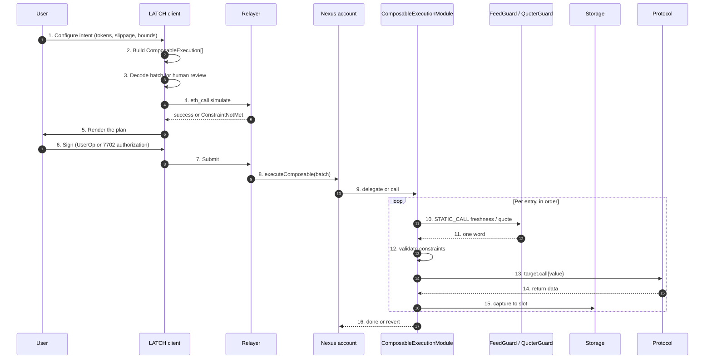
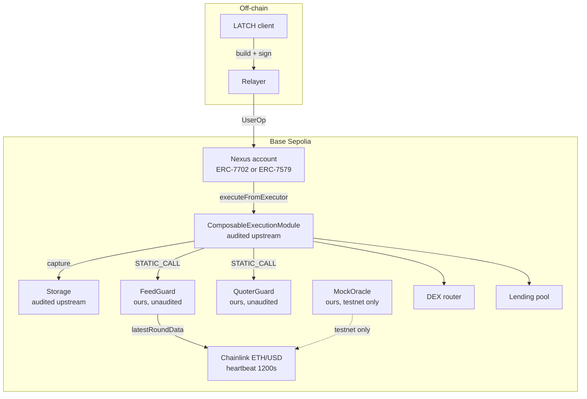

# System architecture

How a LATCH intent becomes an atomic on-chain batch on Base Sepolia, and where the trust boundaries
sit.

## Trust boundaries

| Zone | Trusted | Not trusted |
|---|---|---|
| User wallet | The user's own key | — |
| LATCH frontend | Nothing. Renders the batch; does not alter it | — |
| LATCH relayer | Nothing. May reorder, delay or withhold submission | May not modify the signed batch |
| Bundler / MEE | Nothing on content | May censor a UserOp |
| Nexus account | The user's authorisation logic | — |
| `ComposableExecutionModule` | Audited upstream | Pre-1.0 draft, enum order may change |
| `Storage` | Audited upstream | — |
| `FeedGuard`, `QuoterGuard` | **Ours. Unaudited.** | The weakest link |
| Target protocol | Its own correctness | — |
| Chainlink feed | Its own correctness | A stale or manipulated round passes any price bound |

Two consequences shape every design decision here.

First, **no trusted intermediary decides whether the batch executes.** Constraints are evaluated
on-chain by the module. A relayer that refuses to submit causes a missed opportunity, not a wrong
outcome.

Second, the composability module is upstream and unaudited *by us*. We do not fork it. `FailSafeExecutor`
drives it through documented public entry points precisely so that the audited surface stays intact
and the unaudited surface is confined to our own contracts. See
[05-failure-semantics.md](05-failure-semantics.md).

## Components

| Component | Location | Owner | Role |
|---|---|---|---|
| Nexus account | ERC-7579 / ERC-7702 | Biconomy | Account, module registry, authorisation |
| `ComposableExecutionModule` | `0x0000821108B5C9F3fe17E40811bE5b66DaF8f0e7` | Biconomy | Resolves fetchers, validates constraints, executes entries |
| `Storage` | `0x00008211dea1Aca67ac55fc44AE3bF88CF41281d` | Biconomy | Carries captured values between entries |
| `FeedGuard` | deploy | LATCH | Single-word freshness verdict over a Chainlink feed |
| `QuoterGuard` | deploy | LATCH | Runtime slippage bound computation |
| `FailSafeExecutor` | deploy, optional | LATCH | Segment driver offering `SKIP_CALL` semantics |
| `MockOracle` | deploy, testnet only | LATCH | Deterministic feed for demos |
| Chainlink feed | `0x4aDC67696bA383F43DD60A9e78F2C97Fbbfc7cb1` | Chainlink | ETH/USD, heartbeat 1200s |
| Web client | web | LATCH | Batch builder, decoder, signing |
| Relayer | off-chain | LATCH | Simulate, submit, retry |

Addresses are subject to [verification-log.md](appendix/verification-log.md) items V-02 and V-03.

## The pipeline

The deck described this as four steps. It is more accurate as four steps plus a gate that decides
whether they happen at all.



Steps 10 and 12 are where LATCH contributes. Step 12 is upstream. Step 10 exists only because
constraints cannot express arithmetic or relative time.

## Entry 1 — intent construction

The client turns user choices into a `ComposableExecution[]`. No value that depends on chain state is
known at this point; only literals and fetcher tags are.

```typescript
const batch = createComposableBatch(publicClient, scaAddress);
const weth  = batch.erc20Token(WETH);
const feed  = batch.contract(FEED_GUARD, FEED_GUARD_ABI);

batch.add([
  // Gate 0: the feed must be fresh before anything else is attempted.
  feed.check({
    functionName: "isFresh",
    args: [ETH_USD_FEED, MAX_STALENESS],
    constraint: { eq: 1n },
  }),

  // Step 1: swap, minimum output resolved on-chain.
  router.write({
    functionName: "exactInputSingle",
    args: [tokenIn, WETH, amountIn, MIN_OUT_LITERAL, RECIPIENT],
  }),

  // Step 2: assert the swap actually produced enough.
  weth.check({
    functionName: "balanceOf",
    args: [scaAddress],
    constraint: { gte: minOut },
  }),
]);

const calls = await batch.toCalls();
```

`MIN_OUT_LITERAL` is computed off-chain at signing from a quote. Where the bound must itself track
the live price, `QuoterGuard` replaces it with a `STATIC_CALL` fetcher. Both options are compared in
[04-constraints-and-oracles.md](04-constraints-and-oracles.md).

## Entry 2 — authorisation and delivery

Two account modes. ADR-0005 records the choice.

| Mode | Shape | Signer produces | Use in LATCH |
|---|---|---|---|
| ERC-7702 | EOA delegates code to the Nexus singleton | an authorization tuple, then a UserOp | **Primary.** No pre-funding, no separate deployment |
| ERC-7579 | Nexus counterfactual account, bundler-submitted | a UserOp | Fallback for external-wallet flows |

The trust root is the UserOp signature validated by the EntryPoint, plus any `ModuleEnableMode`
signature that installed the composability module. The EIP-712 intent the client asks the user to
sign is an **application-layer convenience**, not the authorisation. See
[06-frontend-blueprint.md](06-frontend-blueprint.md) for why conflating the two is a security bug.

## Entry 3 — resolution and execution

Inside `ComposableExecutionModule._executeComposable`, per entry:

1. `processInputs` walks `inputParams`, resolving each fetcher and validating its constraints.
   `TARGET` and `VALUE` may appear at most once each. `CALL_DATA` contributions are concatenated
   after `functionSig`.
2. If the composed target is `address(0)`, the entry is a predicate: no call, but every fetcher and
   constraint still ran.
3. Otherwise the entry is dispatched via `executeFromExecutor` with
   `ModeLib.encodeSimpleSingle()`.
4. `processOutputs` writes captured values into `Storage`.

## Entry 4 — cross-entry data flow

There are exactly two channels for one entry to depend on another.

| Channel | Mechanism | Lifetime |
|---|---|---|
| Balance observation | `BALANCE` fetcher reads live state after the previous entry | Same transaction |
| Value capture | `EXEC_RESULT` or `STATIC_CALL` capture into `Storage`, read back by a later `STATIC_CALL` fetcher | Same batch, or a later transaction |

Balance observation is the idiomatic path for "use whatever the previous step produced". Capture is
required when the value is a return value rather than a balance — for example a vault's
`convertToAssets` output.

The namespace rule in [adr/0003-storage-namespace.md](adr/0003-storage-namespace.md) applies to the
capture channel only, and it is the reason LATCH pins the `call` flow.

## Deployment topology

Base Sepolia, chain ID 84532.



`MockOracle` stands in for a DEX or feed during the demo by having the UI push values directly, so a
presentation is reproducible regardless of live market conditions. It is never referenced in a
production configuration, and `FeedGuard` treats it as just another feed address.

## Gas and limits

Gas is dominated by per-entry fetcher `staticcall`s and constraint checks, not by calldata. A
six-entry batch with four fetches is comfortably inside a single UserOp on an L2. Exact figures must
be measured, not assumed — `10-deployment-runbook.md` specifies the measurement, and
[09-testing-strategy.md](09-testing-strategy.md) requires a gas snapshot test so regressions are
visible.

## Failure model at a glance

| Failure | Effect | Detection |
|---|---|---|
| Constraint fails | Whole batch reverts, no state change | `eth_call` pre-flight, or receipt status |
| Fetcher `staticcall` reverts | Whole batch reverts | `ComposableExecutionFailed` |
| Feed stale | Reverts at the gate, before any value moves | `ConstraintNotMet(EQ)` |
| Feed manipulated but fresh | Passes every bound we can express | Off-chain monitoring only |
| Target protocol reverts | Whole batch reverts | Receipt status |
| Relayer withholds | Nothing happens | Transaction monitoring |

The fourth row is the honest limit of this design, and it is stated plainly in
[08-security-model.md](08-security-model.md) rather than buried.

## Related documents

| Document | Covers |
|---|---|
| [02](02-erc8211-spec-notes.md) | The encoding these components implement |
| [03](03-module-integration.md) | Nexus wiring, module installation |
| [04](04-constraints-and-oracles.md) | `FeedGuard`, `QuoterGuard` |
| [05](05-failure-semantics.md) | `FailSafeExecutor` |
| [13](13-composition-patterns.md) | Full worked flows |