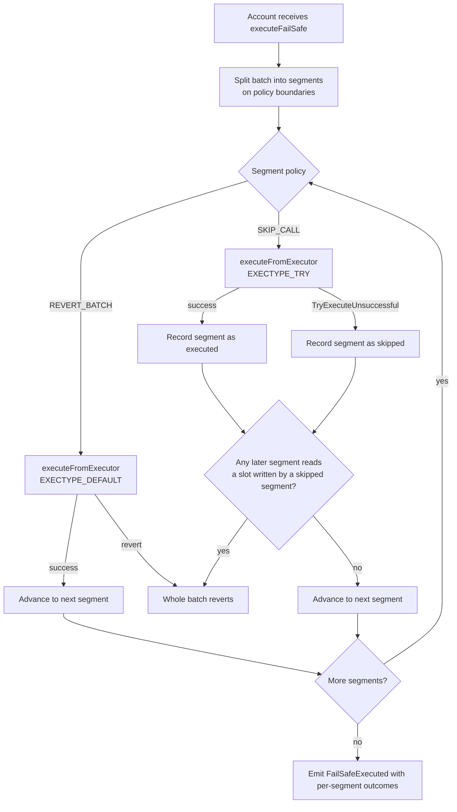

# Failure semantics

What actually happens when part of a batch fails, why the deck's `SKIP_CALL` is not a property of
ERC-8211, and how LATCH adds it without modifying the audited engine.

## First, the correction

The source deck presents configurable failure policies — `REVERT_BATCH` versus `SKIP_CALL` — as a
feature of the execution module. It is not. Three facts, each verified in source:

**1. ERC-8211 batches are strictly atomic.** The module's loop has no error handling:

```solidity
if (execution.target != address(0)) {
    returnData = executeExecutionFunction(execution);
} else {
    returnData = new bytes[](1);
    returnData[0] = "";
}
```

A revert inside `executeExecutionFunction` propagates out of `_executeComposable` and kills the batch.

**2. The module always requests the reverting exec type.**

```solidity
function _executeExecutionCall(Execution memory execution) internal returns (bytes[] memory) {
    return IERC7579Account(msg.sender)
        .executeFromExecutor({
            mode: ModeLib.encodeSimpleSingle(),
            executionCalldata: ExecutionLib.encodeSingle(execution.target, execution.value, execution.callData)
        });
}
```

`ModeLib.encodeSimpleSingle()` is `CALLTYPE_SINGLE` with `EXECTYPE_DEFAULT`. There is no code path in
this contract that requests `EXECTYPE_TRY`.

**3. `SKIP` is a constraint, not a policy.**

```solidity
} else if (ct == ConstraintType.SKIP) {
    // Enforce the NatSpec contract: SKIP carries no payload...
    if (c.referenceData.length != 0) revert InvalidReferenceDataLength();
    return true;
}
```

It unconditionally returns true. Its purpose, per its own NatSpec, is to let a signer *"ignore a
specific 32-byte field while still checking later ones at fixed positions, without padding with dummy
always-true predicates."* It has no relationship to skipping a call.

So `SKIP_CALL` is not a configuration flag we can set. It does not exist in the audited module, and
adding it there would mean forking audited code.

## But the account is supposed to support it

This is the opening, and it carries an unverified precondition. Nexus's `supportsExecutionMode` on the
`main` branch accepts both exec types:

```solidity
function supportsExecutionMode(ExecutionMode mode) external view virtual returns (bool isSupported) {
    (CallType callType, ExecType execType) = mode.decodeBasic();
    return (callType == CALLTYPE_SINGLE || callType == CALLTYPE_BATCH || callType == CALLTYPE_DELEGATECALL)
        && (execType == EXECTYPE_DEFAULT || execType == EXECTYPE_TRY);
}
```

`Nexus.sol`, line 425.

The account is therefore expected to permit a caller to request `EXECTYPE_TRY`, to emit
`TryExecuteUnsuccessful(callData, result)` on a caught failure, and for `_tryExecuteBatch` to continue
past failures. **The account is supposed to support what the module declines to use.** That is the entire
basis for the design below.

> ### Verified on chain, 2026-10-02
>
> A bytecode survey settled this. All four Nexus builds deployed on Base Sepolia carry the
> `TryExecuteUnsuccessful(bytes,bytes)` event topic, topic0
> `0xb5282692b8c578af7fb880895d599035496b5e64d1f14bf428a1ed3bc406f662`, plus
> `TryDelegateCallUnsuccessful` and the `executeFromExecutor` selector. A contract cannot hold an event
> topic it cannot emit, so try-execution is implemented. **V-14 is resolved.**
>
> The `supportsExecutionMode` revert that first suggested otherwise was a red herring. That selector
> comes from `main` and is in none of the deployed dispatchers. See V-19.
>
> The build to target is `0x0000000020fe2F30453074aD916eDeB653eC7E9D`, `biconomy.nexus.1.3.1`. The address
> in Biconomy's own documentation is an older `1.2.0` build with no `executeComposable` at all.
>
> The lesson worth keeping: **verify the deployed build, not `main`.** A capability proven from a source
> branch is a hypothesis about a deployment. This one would have cost the project its headline component.

## Atomicity truth table

| Situation | ERC-8211 default | With `FailSafeExecutor` and `SKIP_CALL` |
|---|---|---|
| A constraint fails in entry *n* | Whole batch reverts | Segment containing *n* is skipped; batch continues |
| Entry *n*'s target call reverts | Whole batch reverts | Segment containing *n* is skipped; batch continues |
| A `STATIC_CALL` fetcher reverts | Whole batch reverts, `ComposableExecutionFailed` | **Whole batch reverts.** Constraints and gates must never be skippable |
| Entry *n* has `target == address(0)` | Resolves and validates, no call | Unchanged — predicates are gates, not work |
| A later entry reads a skipped entry's captured value | Whole batch reverts on the read | **Whole batch reverts.** See the provenance invariant |
| Output capture reverts | Whole batch reverts | Segment skipped, but provenance still enforced |
| EntryPoint or bundler rejects | Nothing happens | Unchanged |

The asymmetry is intentional. A **value movement** failure can be survivable. A **safety assertion**
failure cannot: if the freshness gate fails, continuing means trading on a price we just decided not
to trust.

## Design: `FailSafeExecutor`

An ERC-7579 executor module (type `2`) that drives the **unmodified** `ComposableExecutionModule`
through segments, choosing the exec type per segment.



### Segment boundaries

A batch is authored with a policy bitmap parallel to `ComposableExecution[]`:

```solidity
enum FailurePolicy { REVERT_BATCH, SKIP_CALL }

struct FailSafeSegment {
    ComposableExecution[] executions;
    FailurePolicy policy;
    bytes32[] readsSlots;      // storage slots this segment reads
    bytes32[] writesSlots;     // storage slots this segment writes
}
```

Segments are contiguous runs sharing one policy. A `REVERT_BATCH` entry immediately after a
`SKIP_CALL` entry forces a new segment.

### The critical constraint

A segment cannot contain a predicate entry whose policy is `SKIP_CALL`. Predicate entries are
`target == address(0)`; skipping them would mean skipping the assertion itself. The builder must
reject such a segment, and the on-chain executor must re-check it — a client-side check alone is not
trustworthy, since the client is not in the trust boundary.

```solidity
function _validateSegment(FailSafeSegment memory seg) private pure {
    if (seg.policy != FailurePolicy.SKIP_CALL) return;
    for (uint256 i; i < seg.executions.length; i++) {
        // A predicate entry in a skippable segment could be skipped, which would
        // mean skipping a safety assertion. Not permitted.
        require(_hasTarget(seg.executions[i]), PredicateNotSkippable());
    }
}
```

### The provenance invariant

This is the part that makes partial failure safe rather than dangerous.

**If a segment is skipped, every storage slot it would have written is poisoned. Any later segment
that reads a poisoned slot causes the whole batch to revert.**

Without this rule, a skipped swap followed by a supply sized from that swap's captured output would
supply a stale or zero amount. With it, the failure is loud.

```solidity
mapping(bytes32 => bool) private _poisoned;   // base slot -> poisoned

function _advance(FailSafeSegment[] calldata segs, uint256 i) private {
    FailSafeSegment calldata seg = segs[i];

    // Any slot this segment reads must be live.
    for (uint256 s; s < seg.readsSlots.length; s++) {
        if (_poisoned[seg.readsSlots[s]]) revert SkippedDependency();
    }

    if (seg.policy == FailurePolicy.REVERT_BATCH) {
        _callModule(seg);                                  // reverts propagate
        return;
    }

    (bool ok, bytes memory err) = _callModuleTry(seg);
    if (!ok) {
        for (uint256 w; w < seg.writesSlots.length; w++) {
            _poisoned[seg.writesSlots[w]] = true;
        }
        emit SegmentSkipped(i, err);
    } else {
        emit SegmentExecuted(i);
    }
}
```

### `readsSlots` and `writesSlots` must be derived, not declared

A client that declares its own slot lists is asking to be trusted. The executor derives them from
the batch itself:

| Slot relationship | How it is derived |
|---|---|
| Written by segment | Every `OutputParam` whose fetcher is `EXEC_RESULT` or `STATIC_CALL`, keyed by its `baseSlot` |
| Read by segment | Every `InputParam` whose fetcher is `STATIC_CALL` targeting the storage contract's `readStorage(address,bytes32)` selector, with the slot decoded from the argument |
| Balance observation | Not a slot read. A `BALANCE` fetcher re-reads live state, so a skipped segment's writes simply are not reflected, and the balance constraint decides whether that is acceptable |

The last row is a genuine improvement over the naive design. `BALANCE` reads state as it is at
execution, so a skipped swap simply means the next `BALANCE` sees the unchanged balance. If the
segment had a minimum-output constraint, that constraint fails and the segment reverts — which is
correct behaviour, arrived at by the existing constraint machinery.

### Poising lifetime

`_poisoned` is per-transaction state in the module. It must not persist. Since the executor runs
entirely within one UserOp, an ordinary mapping is sufficient, but the mapping must be cleared or
scoped so a second call in the same transaction cannot inherit poison from the first. Either clear at
the top of the entry point or key by a per-call nonce.

### Invocation and access control

`FailSafeExecutor` is a **delegatecall target**, not an installed ERC-7579 module, because the
composability module dispatches through `IERC7579Account(msg.sender)` and so must be called by the
account. Under `delegatecall` the executor's outbound call originates from the account.

```
account.execute(
    encode(CALLTYPE_DELEGATECALL, EXECTYPE_DEFAULT, MODE_DEFAULT, payload),
    abi.encodePacked(address(failSafe), abi.encodeCall(FailSafeExecutor.executeFailSafe, (segments)))
);
```

Authorisation is `msg.sender == address(this)` or `msg.sender == ENTRY_POINT_V07`. There is no
per-account EntryPoint registry, because a delegatecall target cannot hold one: its storage is the
account's, so a mapping written by a direct `onInstall` is read from a different slot on the next
call. Verified by `test_rejectsAnUnregisteredEntryPoint`.

Three checks, all implemented:

1. Every segment passes `_validateSegment`. A predicate in a skippable segment reverts.
2. Derived slots are well formed. A malformed `readStorage` argument reverts rather than being treated
   as "reads nothing" — that would silently disable the provenance check.
3. The poison key is the **derived** value slot, `keccak256(abi.encodePacked(baseSlot, i))`, because
   that is what the engine writes and what a read looks up.

### Storage

None. See [adr/0002](adr/0002-fail-safe-executor.md#storage-the-hard-constraint) for why that is a hard
requirement rather than a preference, and for the `delete`-on-2^64-elements failure that proved it.

## Honest limitations

| Limitation | Consequence | Mitigation |
|---|---|---|
| `FailSafeExecutor` is **unaudited new Solidity** | The weakest component in the project | Ship `REVERT_BATCH`-only as the default. Feature-flag `SKIP_CALL` off in the demo config. Record as a named risk in `12` |
| A skipped segment's gas is still paid | `SKIP_CALL` saves value, not gas | State this in the UI. Implemented: the failed inner call still burns its gas |
| The poison array is bounded at 2,048 slots | A larger batch would stop poisoning silently | Gas-bounding, unreachable in practice. A cliff rather than a revert, and recorded in `adr-0002` |
| No per-account EntryPoint registration | Only v0.7 or self is authorised | A delegatecall target cannot hold a registry. Changing a constant is the alternative |
| A segment boundary is a coarse unit | A segment containing one important and nine optional calls reverts entirely | Keep segments small. The builder should warn when a segment mixes critical and optional entries |
| Provenance covers `Storage` only | Cross-segment dependencies expressed via `BALANCE` are not tracked | Accepted by design: `BALANCE` observes live state, and constraints decide acceptability |
| Ordering within a segment is still sequential and atomic | No parallelism is gained | None needed; ERC-8211's loop is already sequential |
| A skipped segment may leave approvals behind | Dust approvals persist | Documented in the UI. ERC-20 approvals to known routers are the common case and are idempotent |

## What we deliberately do not build

| Not building | Reason |
|---|---|
| A `try`-capable fork of the composability module | Forks audited code. The whole point of `FailSafeExecutor` is to avoid that |
| `SKIP_CALL` on predicate entries | Would permit skipping a safety assertion. See the critical constraint |
| Automatic retry of a skipped segment within the batch | The skipped state has already changed; a retry would act on a different world |
| Cross-transaction segment persistence | Complicates the poisoning model for a benefit we do not need on a single-chain batch |
| Configurable partial failure through the audited module | Not expressible. Anyone claiming otherwise has not read `_executeComposable` |

## Recommendation for the demo

Default configuration: **`REVERT_BATCH` everywhere.** Then, as a deliberate second demonstration,
enable a single `SKIP_CALL` segment — the optional cleanup step — and show the batch completing where
it would otherwise have reverted.

That ordering matters. If `SKIP_CALL` is on by default, a judge may conclude the atomic safety story
is weaker than it is. If it is introduced as an explicit opt-in with the invariant explained, the
atomic guarantee reads as the default and the extension reads as a feature.

## Related documents

| Document | Covers |
|---|---|
| [02](02-erc8211-spec-notes.md) | `SKIP` semantics, error catalogue |
| [technical-reference/nexus-execution-helper.md](technical-reference/nexus-execution-helper.md) | Verbatim `EXECTYPE_TRY` support and `TryExecuteUnsuccessful` |
| [03](03-module-integration.md) | Executor module installation, uninstall path |
| [08](08-security-model.md) | Threat rows for partial failure |
| [12](12-risk-matrix.md) | Residual risk from unaudited Solidity |
| [adr/0001](adr/0001-atomicity.md) | Why atomic is the default |
| [adr/0002](adr/0002-fail-safe-executor.md) | Why segment rather than patch |