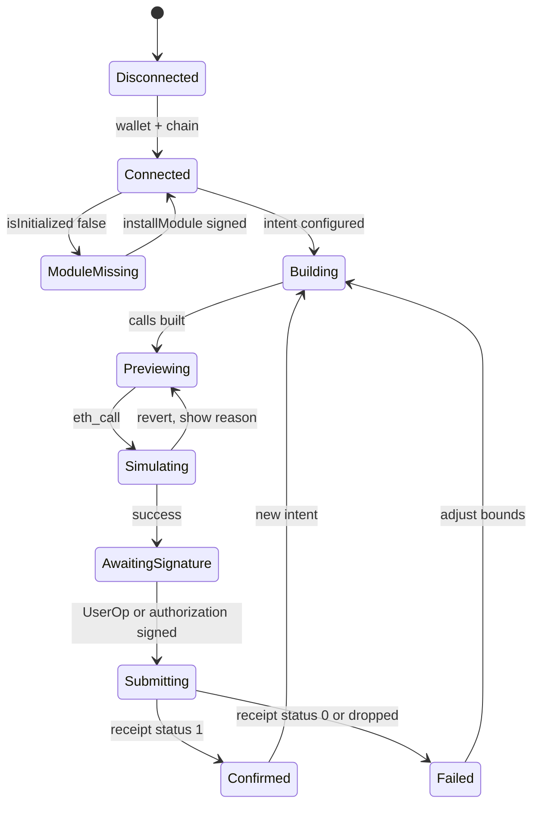

# Frontend blueprint

React and Vite client that builds the batch, decodes it for human review, and collects the signature.
The most important section in this document is [Two signatures](#two-signatures-and-why-they-are-not-interchangeable),
because conflating them is how these systems get exploited.

## Stack

| Layer | Choice | Note |
|---|---|---|
| Framework | React 18 + TypeScript, Vite | Matches the deck's stated stack |
| Chain access | viem | Matches the deck |
| Batch construction | `@biconomy/smart-batching` | Type-safe, produces `ComposableCall[]` |
| Account | `@biconomy/abstractjs` | Nexus via `toMultichainNexusAccount` |
| Network | Base Sepolia, chain ID 84532 | See `10-deployment-runbook.md` |
| Wallet | viem wallet client | EIP-1193 or injected |

**As built.** `web/` installs neither Biconomy package. The batch is constructed by `@latch/client`,
whose ABI codec exists because `viem` cannot encode the nested tuple (see
[09](09-testing-strategy.md)); the two MEE paths are declared and refuse by name rather than
downgrading silently to a raw send. The rows above are the stack those paths will use when the SDK
is a dependency.

The deck claims EIP-712 structured signing for intent submission. That is true and it is a
**convenience layer**, not the authorisation mechanism. The section below is explicit about why.

## Two signatures, and why they are not interchangeable

| Signature | What it authorises | Who validates |
|---|---|---|
| **UserOp signature** (or EIP-7702 authorization) | The on-chain transaction. Without it, nothing executes | EntryPoint, then the Nexus validator module |
| **EIP-712 intent** (LATCH app layer) | A binding of the batch to this app, this chain, this account, and an expiry | LATCH's own backend, if it checks one at all |

The UserOp signature is the trust root. It commits to `callData`, which contains the batch, which
contains every target and every constraint. That is the real authorisation, and it is what stops
someone from submitting a different batch.

The EIP-712 intent adds three things the UserOp does not:

1. **Legibility.** A wallet shows a typed-data payload; it shows raw calldata as a hex blob.
2. **Expiry.** `validUntil` lets a batch die if it sits in a mempool too long.
3. **Replay scoping across applications.** Two frontends could otherwise present different UI for the
   same account.

What it does **not** add is authorisation. If LATCH's backend accepts a submission based solely on an
EIP-712 signature, an attacker who observes a valid intent can submit it — and the UserOp they
construct will validate, because they can sign it themselves or the account's validator accepts their
own signature. The EIP-712 signature was never checked by anything that matters.

**Rule for the implementation.** The relayer must treat the EIP-712 intent as presentation and
bookkeeping. The batch it submits must be the batch derived from the UserOp the account signed. If the
two disagree, the UserOp wins and the intent is discarded.

## EIP-712 intent shape

```typescript
import { keccak256, encodePacked, toHex } from "viem";

export const INTENT_TYPES = {
  DeclarativeIntent: [
    { name: "account",   type: "address" },
    { name: "batchHash", type: "bytes32" },
    { name: "module",    type: "address" },
    { name: "chainId",   type: "uint256" },
    { name: "nonce",     type: "uint256" },
    { name: "validUntil", type: "uint256" },
  ],
} as const;

export const domain = {
  name: "LATCH",
  version: "1",
  chainId: 84532,
  // The account address. Binds the intent to this account, not to a LATCH contract,
  // because there is no LATCH contract that verifies it.
  verifyingContract: accountAddress,
} as const;
```

`batchHash` is `keccak256(abi.encode(composableCalls))` over the exact `ComposableCall[]` handed to the
execution layer. Hashing the encoded calls rather than a hand-rolled summary means the two cannot
diverge.

`module` records the composability module address, so an intent signed against one module version is
visibly not the same intent as one signed against another.

### Why the domain is bound this way

| Field | Prevents |
|---|---|
| `name: "LATCH"` | Signature reuse by an unrelated app that also asks for typed data |
| `version` | Replay of a v1 intent by a v2 client with different semantics |
| `chainId: 84532` | Replay on Ethereum mainnet or any other chain |
| `verifyingContract: accountAddress` | Replay against a different account of the same owner |

Chain and account binding are the two that matter. The deck's claim of "strict domain separators tied
to specific chain IDs and accounts" is correct and is exactly this table.

## Component tree

```
<App>
├── <ConnectWallet>          account, chain, module-installed status
├── <IntentBuilder>
│   ├── <TokenSelector>      input token
│   ├── <AmountInput>        amount, parsed — never defaulted
│   ├── <SlippageControl>    fixed presets only. Never free text. See below
│   ├── <BoundsEditor>       min output, price band, max staleness
│   └── <PolicyToggle>       REVERT_BATCH | SKIP_CALL, per segment
├── <BatchPreview>           ← the decoder. The most important component
├── <SimulationPanel>       eth_call result, revert reason, gas
├── <SignButton>             EIP-712, then UserOp or authorization
├── <ExecutionTracker>       submission, receipt, decoded events
└── <DemoPanel>              presenter's driver. Refuses to run on an unconfigured address
```

The page around them is header, hero, the three explanatory sections, and footer. Everything meets
in the composition root; feature components never import one another.

### `<BatchPreview>`

A user cannot meaningfully review a hex blob. This component renders the batch as a numbered list of
steps, each showing: the decoded target name and function, which parameters are literals and which are
runtime values, and which constraint gates it.

```typescript
function describeEntry(entry: ComposableCall, i: number): StepView {
  const runtime = entry.inputParams.filter(p =>
    p.fetcherType !== InputParamFetcherType.RAW_BYTES
  );
  const gates = entry.inputParams.flatMap(p =>
    p.constraints.map(c => describeConstraint(c))
  );
  return {
    index: i,
    target: decodeTarget(entry, TARGETS),
    fn: decodeSignature(entry.functionSig),
    runtime,
    gates,
    isPredicate: !entry.inputParams.some(p => p.paramType === InputParamType.TARGET),
  };
}
```

Three rules for the decoder, each of which exists because getting it wrong misleads the user:

1. **Render `SKIP` as "not checked", not as a passing check.** A user seeing a green check on a field
   that was never validated is worse than seeing no check.
2. **Render the constraint's actual comparison.** `GTE 1000` and `LTE 1000` both appear as a green tick.
   Show the operator.
3. **Never render a `STATIC_CALL` fetcher's resolved value as known.** It does not exist until
   execution. Show the *call* that will produce it.

Rule 3 is the one most likely to be violated, because the client has often already simulated the batch
and has a value in hand. Simulation values are labelled as simulated, never as guaranteed.

### `<SlippageControl>`

Presets only. Biconomy's published guidance:

| Pair type | Suggested slippage |
|---|---|
| Stable to stable | 0.5% |
| Stable to volatile | 1% |
| Volatile to volatile, long bridge | 3% |
| Complex multi-chain rebalancing | 2–3% |

A free-text field is a foot-gun in both directions: a user who types `0.1` will lose a trade to
ordinary price impact, and a user who types `50` disables the guard entirely while the UI still shows
green ticks. Presets with the numeric value displayed solve both.

### `<PolicyToggle>`

Default `REVERT_BATCH` on every segment. `SKIP_CALL` is opt-in per segment, and selecting it triggers
a confirmation that names what will be skipped and what the provenance invariant does. See
[05-failure-semantics.md](05-failure-semantics.md).

## Build and preview flow

**As built.** Without the Biconomy SDK, the batch is built by `@latch/client` and the preview is a
`viem` `call` plus `estimateGas` against a pinned sender on one chain. The sample below is the shape
the MEE wiring will use.

```typescript
const publicClient = createPublicClient({
  chain: baseSepolia,
  transport: fallback([
    http(PRIMARY_RPC, { batch: true, retryCount: 3, retryDelay: 300, timeout: 10_000 }),
    http(SECONDARY_RPC),
  ]),
});

const account = await toMultichainNexusAccount({
  signer,
  chainConfigurations: [{
    chain: baseSepolia,
    transport: http(RPC_URL),
    version: getMEEVersion(MEEVersion.V2_2_2),   // see verification item V-01
    // accountAddress: signer.address,          // EIP-7702 only. Uncomment for the 7702 demo
  }],
});

const scaAddress = account.addressOn(baseSepolia.id, true);

const batch = createComposableBatch(publicClient, scaAddress);
// ... add entries ...
const calls = await batch.toCalls();
```

`addressOn(chainId, true)` enables strict mode, which throws if the chain was not declared in
`chainConfigurations`. That converts a whole class of silent misconfiguration into an immediate error.

## RPC fallback

The deck names "multi-provider RPC connection fallbacks" as a mitigation for rate limits. Viem's
`fallback` array rotates transports on failure:

```typescript
const client = createPublicClient({
  chain: baseSepolia,
  transport: fallback([
    http(PRIMARY_RPC, { batch: true, retryCount: 3, retryDelay: 300, timeout: 10_000 }),
    http(SECONDARY_RPC),
    http(TERTIARY_RPC),
  ]),
});
```

`web/src/core/chain.ts` splits this in two: `readClient` takes the list above, and `writeClient` is a
single `http(RPC_URLS[0])`. A rotating transport is how a timed-out call becomes two transactions.

Two cautions:

- **Fallback is per-call, not per-transaction.** A transaction submitted over provider A and a receipt
  polled over provider B is fine. A transaction submitted twice because the first attempt timed out
  after broadcast is **not** fine. Never retry a *write* on timeout without first checking whether it
  landed. See [07-relayer-and-keepers.md](07-relayer-and-keepers.md).
- **Stale reads are worse than failed reads.** Some fallback providers lag. A stale oracle read used
  to build a constraint is a wrong constraint. The client should prefer a single low-latency provider
  for anything feeding a bound, and use fallbacks only for non-critical reads.

## Execution paths

| Path | Used when | Signed by user |
|---|---|---|
| `meeClient.getQuote` / `executeQuote` | MEE available, want sponsorship or cross-chain | MEE payload |
| `meeClient.getFusionQuote` | External wallet (MetaMask, Rabby) | Fusion payload |
| Bundler UserOp | Self-hosted bundler, `toNexusAccount` | UserOp |
| Raw `executeComposable` | Debugging, direct verification | UserOp |

**As built.** This build wires one path: `raw`, sent through the injected wallet over
`eth_sendTransaction`, not sponsored. The `mee` and `fusion` paths exist, are labelled as
unavailable, and reject with `MEE path not wired — requires @biconomy/abstractjs`. V-01 settles the
account version question before either can be wired for real.

The MEE quote instruction marks a batch as composable:

```typescript
const quote = await meeClient.getQuote({
  instructions: [{ calls, chainId: baseSepolia.id, isComposable: true }],
  feeToken: { address: USDC, chainId: baseSepolia.id },
});
const { hash } = await meeClient.executeQuote({ quote });
```

`isComposable: true` is what routes the instruction through the ERC-8211 module rather than ordinary
batch execution. Omitting it produces a plain batch with static parameters — which looks like it works
and silently discards every runtime value.

## UI state machine



`Simulating` must show the revert reason, mapped to something a user can act on. A raw
`ConstraintNotMet` selector is not an error message; "Output was below your 0.5% minimum — raise slippage
or retry" is. The mapping table belongs in the same file as the decoder, because both read the same
struct.

The diagram is the happy spine. `TRANSITIONS` in `web/src/app/state/types.ts` also carries the
recovery edges — disconnect from any live phase, edit a preview back to `building`, cancel a
signature back to `previewing`, retry from `failed` — and rejects any move that is not listed rather
than applying it.

## Environment

What `web/` actually reads:

| Variable | Purpose |
|---|---|
| `VITE_RPC_PRIMARY`, `VITE_RPC_SECONDARY`, `VITE_RPC_TERTIARY` | Public RPC endpoints. An unset slot is skipped, never substituted |
| `VITE_FEED_GUARD` | Deployed `FeedGuard`. Empty means `not configured`, never a plausible address |
| `VITE_QUOTER_GUARD` | Deployed `QuoterGuard`. Same rule |
| `VITE_FAILSAFE` | `off` by default. See `adr/0002` |
| `VITE_MOCK_ORACLE` | Demo oracle address. Unset or malformed, and the demo driver disables itself |
| `VITE_EXPLORER_URL` | Explorer base URL for receipt links. Unset, and the tracker prints the hash to paste |
| `VITE_BICONOMY_API_KEY` | MEE sponsorship. Not read by this build; required once the SDK is a dependency |

What is not an environment variable: `chainId`, the composability module and composable storage are
constants in `web/src/core/addresses.ts`. `VITE_CHAIN_ID` is not read. Pinning them in source puts
them in review rather than in one deployment's `.env`, which is the same argument as below.

Module and helper addresses are configuration, never discovered from the chain at runtime. A selector
collision or an address swap must be caught by review, not by whatever the network returns.

## Related documents

| Document | Covers |
|---|---|
| [02](02-erc8211-spec-notes.md) | Struct shapes the decoder reads |
| [04](04-constraints-and-oracles.md) | What bounds the UI exposes |
| [07](07-relayer-and-keepers.md) | Submission and retry |
| [09](09-testing-strategy.md) | Client-side tests |
| [08](08-security-model.md) | Replay and authorisation threats |