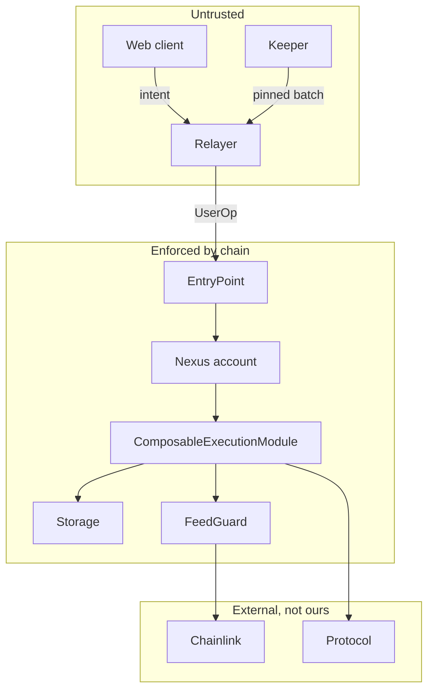

# Security model

Adversarial analysis of LATCH. Fourteen threat rows, the properties that actually hold, and an
explicit statement of what this design does not protect against.

## Properties LATCH claims

| # | Property | Enforced by | Holds because |
|---|---|---|---|
| P1 | No trusted intermediary decides whether a batch executes | `ComposableExecutionModule` | Constraints are evaluated on-chain. A withholding relayer causes a missed opportunity, not a wrong outcome |
| P2 | A failed constraint commits nothing | Module loop, `REVERT_BATCH` | Every entry runs inside one call frame; a revert unwinds all of it |
| P3 | Runtime values cannot be tampered with | On-chain fetcher resolution | Values are resolved by `staticcall` at execution, not supplied by the submitter |
| P4 | A batch cannot be modified after signing | UserOp signature over `callData` | EntryPoint and the Nexus validator both verify the signature |
| P5 | Storage values are namespaced per account | `Storage.getNamespace` | `keccak256(account, account)` under the pinned call flow |
| P6 | Stale oracle data is rejected before any value moves | `FeedGuard` + `EQ 1` | The gate is the first entry, and it precedes every movement |

## Assets

| Asset | Held by | Attack value |
|---|---|---|
| User token balances | The Nexus account | Total loss |
| User approvals | The Nexus account | Indirect loss via a malicious spender |
| The user's EOA key | The user | Total loss, outside our boundary |
| `FeedGuard`, `QuoterGuard` | Stateless | Low directly. High indirectly, as a wrong answer misleads every gate |
| `MockOracle` | Testnet only | None, provided it is never in a production config |

`FeedGuard` holds no funds and no approvals. Its risk is entirely in returning a wrong verdict, which
is why it is audited-first in the test plan and named as a top residual risk in
[12-risk-matrix.md](12-risk-matrix.md).

## Trust boundaries



Everything left of "Enforced" is replaceable. Everything inside it is auditable. Chainlink and the
target protocol are outside our control, which is why their failures appear as rows rather than as
mitigations.

## Threat table

| # | Threat | Boundary | Severity | Mitigation | Status |
|---|---|---|---|---|---|
| T1 | Batch modified after signing | Relayer | Critical | UserOp signature over `callData`. Modified batch fails validation | Mitigated |
| T2 | Batch replayed on another chain | Cross-chain | Critical | EIP-712 domain carries `chainId`; the UserOp is chain-scoped | Mitigated |
| T3 | Intent replayed against a different account | App layer | High | `verifyingContract` is the account address in the domain | Mitigated |
| T4 | `executeComposableCall` installed as a fallback, letting anyone compose batches | Account config | Critical | Use `executeComposable`, which has access control. Audit the installed selector set | Procedural |
| T5 | Signature from the wrong EntryPoint | Account config | High | Module's `entryPoints[account]` registration plus the `DEFAULT_EP_ADDRESS` check | Mitigated |
| T6 | Malicious module install grants arbitrary execution | Account config | Critical | `ModuleEnableMode` signature required. Review every install | Procedural |
| T7 | Storage slot collision across accounts | Storage | High | Namespace is `keccak256(account, account)`. Slots cannot collide | Mitigated |
| T8 | Namespace varies with submission method | Storage | Medium | Call flow pinned in `adr/0003`; verified in the test suite | Mitigated |
| T9 | Stale feed passes a price bound | Oracle | High | `FeedGuard.isFresh` gate precedes every movement. Heartbeat-bounded, and verified live: Base Sepolia stablecoin feeds run 3 to 21 hours old against an 86,400s heartbeat | Mitigated |
| T10 | **Manipulated but fresh, in-band feed** | Oracle | High | **None on-chain.** Requires off-chain monitoring | **Accepted** |
| T11 | `FeedGuard` selector shadowing by a proxy fallback | Contract | Medium | Address pinned in configuration, non-upgradeable, no admin functions | Mitigated |
| T12 | Unaudited `FailSafeExecutor` exploits segment poisoning | Contract | High | Off by default. Provenance derived on-chain, not declared | **Accepted, mitigated by default-off** |
| T13 | Double submission after a write timeout | Client | Medium | Local hash computed pre-broadcast; receipt and mempool checked before retry | Mitigated |
| T14 | Keeper reassembles the batch from a live quote | Keeper | High | By design, keepers submit pinned batches only. Code-level constraint, audited | Procedural |

T10 and T12 are the two that are not fully solved. Both are stated plainly rather than minimised.

## The signature-authority trap

The most common serious mistake in systems shaped like this is treating the application-layer signature
as the authorisation.

If a backend accepts a submission on the strength of a valid EIP-712 intent and constructs a UserOp
itself, then:

1. An attacker who observes an intent replay it against their own submitted UserOp.
2. The batch is identical, so nothing about the intent's contents is violated.
3. The attacker's transaction executes.

The intent signature contributed nothing, because the thing that actually authorised execution was
never verified against it.

The correct relationship:

```
UserOp signature  ──►  authorises callData  ──►  batch executes
       ▲
       │  must be produced by, or bound to, the account's own validator
       │
EIP-712 intent  ──►  presentation, expiry, replay scoping  ──►  nothing on-chain
```

If the client collects an EIP-712 intent *and* a UserOp signature, the backend must verify that both
refer to the same `batchHash`. If they cannot be verified together, the EIP-712 intent must be
discarded rather than trusted. See [06-frontend-blueprint.md](06-frontend-blueprint.md).

## Replay resistance

| Replay vector | Defence |
|---|---|
| Same batch, same chain, later block | `validUntil` in the intent. The UserOp nonce advances. A replayed UserOp fails validation |
| Same batch, different chain | EIP-712 `chainId`; the UserOp itself is chain-scoped |
| Same intent, different account | `verifyingContract` is the account address |
| Same intent, different app | `name: "LATCH"` |
| Same intent, different app version | `version` field |
| Cross-protocol signature reuse | EIP-712 typed-data hashing keeps a different struct hash distinct |

The strongest of these is the one nobody thinks about: a signature over `DeclarativeIntent` cannot be
replayed as a signature over any other struct, because the type hash is part of what is signed.

## Privilege escalation through modules

ERC-7579 gives the account owner the right to install modules that act on the account's behalf. That
is the point of the standard, and it is also the largest standing risk.

| Check | Action |
|---|---|
| Every installed module reviewed before install | Procedure |
| `ModuleEnableMode` signature verified for every install | Upstream |
| Executor modules enumerated after install | `isModuleInstalled` per type ID |
| Fallback selectors enumerated | Must not include `executeComposableCall` |
| Untrusted modules never installed | Procedure |

Nexus provides `EmergencyUninstall` for the case where an installed module becomes hostile or stuck.
Any module LATCH installs must therefore be removable by that path, which in practice means it must
not hold approvals or funds itself.

## Gas griefing and liveness

| Vector | Effect | Mitigation |
|---|---|---|
| Fetcher that consumes all gas | Batch dies late | Fuzz gas bounds in tests; `staticcall` forwards all gas by default, so consider a bounded helper |
| Deeply nested captures | High storage cost | Fixed entry counts in the builder |
| Many predicate entries | Linear gas | The builder warns above a threshold |
| Keeper absent | Conditional batches never trigger | Watchdog in [07](07-relayer-and-keepers.md) |
| EntryPoint or bundler censorship | Nothing executes | Nothing can be done. State it as an availability property, not a security one |

Liveness is an availability property. No amount of on-chain constraint design makes a batch execute if
nobody submits it.

## Upstream audit posture

| Component | Auditor | Date | Scope |
|---|---|---|---|
| Composable execution surface | Pashov Audit Group | March 2025 | `EQ`/`GTE`/`LTE`/`IN`, the three fetchers |
| Same, second pass | Zenith | March 2025 | Same scope |
| Signed constraints, `OR`, `SKIP` | Pashov Audit Group | May 2026 | `GTE_SIGNED`, `LTE_SIGNED`, `IN_SIGNED`, `OR`, `SKIP`, pipeline hardening. Seven findings, all resolved |
| Nexus account | Cyfrin, Spearbit, Zenith, Pashov | — | Per Biconomy |
| `FeedGuard`, `QuoterGuard` | **None** | — | Ours. Unaudited |
| `FailSafeExecutor` | **None** | — | Ours. Unaudited, and off by default |
| `MockOracle` | Not required | — | Testnet only, no privileged paths |

LATCH adds two unaudited contracts to a stack that upstream has audited three times. That is a real
trade: the components exist to close genuine gaps, at the cost of putting unaudited code in the path.
Mitigations: each helper is small and side-effect free, each has a focused test suite, and the riskiest
of the three is disabled by default.

## Explicit non-goals

| Not defended against | Why |
|---|---|
| A malicious or compromised Chainlink feed | Outside our control. T10 |
| A malicious target protocol | Outside our control. A DEX can revert or return bad data |
| Frontend compromise affecting the *user's* key | Outside our boundary |
| Governance capture of an upstream dependency | Documented dependency risk |
| Social engineering a user into signing a malicious intent | Mitigated only by the decoder rendering the plan honestly |

The last row is why the batch decoder exists. A user who cannot read what they are signing is relying
entirely on our UI's good intentions.

## Verification before production

| Requirement | Test |
|---|---|
| No state changes outside the account | Balance and storage diffs across a batch |
| Batch reverts fully on any failed constraint | Foundry, per constraint type |
| Namespace stable across delivery methods | Submit from two senders, compare slots |
| No unaudited contract reachable when defaults are used | Assert config, then simulate |
| `FeedGuard` verdict correct at every boundary | Boundary tests in `09` |

## Related documents

| Document | Covers |
|---|---|
| [02](02-erc8211-spec-notes.md) | Normative behaviour the mitigations rely on |
| [04](04-constraints-and-oracles.md) | `FeedGuard` invariants |
| [05](05-failure-semantics.md) | `FailSafeExecutor` limitations |
| [09](09-testing-strategy.md) | Tests backing these claims |
| [12](12-risk-matrix.md) | Residual risk register |