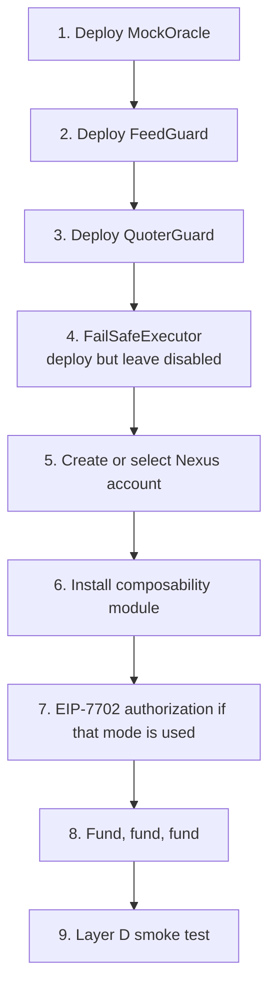

# Deployment runbook

Base Sepolia. Every step names a command and an expected observable, so a failure is identifiable
rather than inferred.

Verification rounds 1 and 2 cleared V-02, V-03, V-04, V-14, V-16 and V-18 on chain. See
[appendix/verification-log.md](appendix/verification-log.md).

**V-01, V-06 and V-07 are now resolved.** The MEE deployment is `2.2.x` against a Nexus `1.3.1`
account (V-01), the DEX has verified routers and real liquidity (V-06), and Aave V3 is live with WETH
as a listed market (V-07). One item now blocks the live slippage bound: **V-23**, the Base Sepolia
address labelled `QuoterV2` does not implement the `QuoterV2` interface. See
[appendix/verification-log.md](appendix/verification-log.md).

**The supply step must use WETH.** USDC is not an Aave market on Base Sepolia and will revert with
`RESERVE_NOT_EXIST`.

> **Step 6 is only needed on Nexus older than 1.3.1.** The account at
> `0x0000000020fe2F30453074aD916eDeB653eC7E9D` implements `executeComposable` natively, so on Base
> Sepolia there is **no `installModule` transaction and no `ModuleEnableMode` signature**. Skip to
> step 7.

## Pre-flight

### Confirm the module and storage exist on Base Sepolia

```bash
RPC=https://base-sepolia.g.alchemy.com/v2/$KEY

for addr in 0x0000821108B5C9F3fe17E40811bE5b66DaF8f0e7 \
            0x00008211dea1Aca67ac55fc44AE3bF88CF41281d; do
  code=$(curl -s -X POST "$RPC" -H 'Content-Type: application/json' \
    -d "{\"jsonrpc\":\"2.0\",\"id\":1,\"method\":\"eth_getCode\",\"params\":[\"$addr\",\"latest\"]}" \
    | python3 -c 'import json,sys; print(len(json.load(sys.stdin)["result"]))')
  echo "$addr code_bytes=$code"
done
```

**Verified 2026-10-02: 6,510 and 575 bytes respectively.** Recorded as resolved. The commands are kept
because the addresses must be re-checked after any redeployment.

### Confirm the module's identity

```bash
# isModuleType(2) should return 0x...01 for executor, 0x...01 for fallback
curl -s -X POST "$RPC" -H 'Content-Type: application/json' -d '{
  "jsonrpc":"2.0","id":1,"method":"eth_call",
  "params":[{"to":"0x0000821108B5C9F3fe17E40811bE5b66DaF8f0e7",
             "data":"0x1d3a7d57"},            // isModuleType(uint256) with 2
             "latest"],"latest"]}'
```

**Verified 2026-10-02.** Observed:

| Call | Result |
|---|---|
| `isModuleType(1)` VALIDATOR | `false` |
| `isModuleType(2)` EXECUTOR | **`true`** |
| `isModuleType(3)` FALLBACK | **`true`** |
| `isModuleType(4)` HOOK | `false` |
| `getEntryPoint(address(1))` | `0x0000000071727De22E5E9d8BAf0edAc6f37da032` |

True for exactly types 2 and 3 reproduces `return moduleTypeId == TYPE_EXECUTOR || moduleTypeId ==
TYPE_FALLBACK;` and independently confirms the EntryPoint v0.7 constant.

### Confirm MEE version support

The Biconomy supported-chains page lists Base Sepolia up to **MEE 2.2.2**. Documentation elsewhere
recommends `2.2.3`. This runbook pins **2.2.2**.

```bash
# SDK-side check, not a shell command
import { getMEEVersion, MEEVersion } from "@biconomy/abstractjs";
console.log(getMEEVersion(MEEVersion.V2_2_2));
```

Expected: a config object. If `2.2.3` also initialises cleanly against Base Sepolia, prefer it and
promote resolution of **V-01**. Either way, do not deploy against an unverified version.

## Environment

```bash
export RPC=https://base-sepolia.g.alchemy.com/v2/$KEY
export DEPLOYER_KEY=0x...
export CHAIN_ID=84532

export COMPOSABILITY_MODULE=0x0000821108B5C9F3fe17E40811bE5b66DaF8f0e7
export COMPOSABLE_STORAGE=0x00008211dea1Aca67ac55fc44AE3bF88CF41281d
export NEXUS_SINGLETON=      # from V-04. 1.2.0 is 0x000000004F43C49e93C970E84001853a70923B03
export BICONOMY_API_KEY=mee_...
```

`NEXUS_SINGLETON` is the one value with no confirmed Base Sepolia address. Do not guess it. Read it
from the SDK's version config or the Biconomy dashboard.

## Deployment order



Steps 1 to 4 are stateless contracts and order does not matter. Step 6 requires a signed account
owner. Step 8 requires test ETH on Base Sepolia, which needs up to ~10 confirmations on the faucet.

### 1. `MockOracle`

```bash
forge create contracts/mocks/MockOracle.sol:MockOracle \
  --rpc-url "$RPC" --private-key "$DEPLOYER_KEY" --broadcast \
  --constructor-args 0x0000000000000000000000000000000000000000
```

Expected: address printed, code present via `eth_getCode`.

Testnet only. Record in a config file marked `testnet`, never in a production config.

### 2. `FeedGuard`

```bash
forge create contracts/FeedGuard.sol:FeedGuard \
  --rpc-url "$RPC" --private-key "$DEPLOYER_KEY" --broadcast
```

Expected: address printed. No constructor arguments, by design — `isFresh` takes the aggregator and
`maxStaleness` per call, so the contract cannot be misconfigured at deploy time.

Verify immediately:

```bash
# isFresh(ETH_USD, 1200)
curl -s -X POST "$RPC" -H 'Content-Type: application/json' -d '{
  "jsonrpc":"2.0","id":1,"method":"eth_call",
  "params":[{"to":"'$FEED_GUARD'",
    "data":"0x2e8d3f8e00000000000000000000000004adc67696ba383f43dd60a9e78f2c97fbfc7cb1000000000000000000000000000000000000000000000000000000000000000000004b0",
    "latest"],"latest"]}'
```

Expected: `0x0000...0001`. A zero means the feed is older than 1200 seconds, which on a fresh testnet
feed is normal for a few minutes after deployment.

If zero persists, the feed is genuinely stale and the gate is working correctly. Wait for the next
heartbeat rather than raising `maxStaleness` reflexively.

### 3. `QuoterGuard`

```bash
forge create contracts/QuoterGuard.sol:QuoterGuard \
  --rpc-url "$RPC" --private-key "$DEPLOYER_KEY" --broadcast
```

Expected: address printed. Verify a quote before relying on it:

```bash
# minAmountOut(quoter, router, tokenIn, tokenOut, amountIn, fee, slippageBps)
```

Expected: a value strictly below an unauthenticated quote for the same arguments. If it is equal or
higher, the slippage division is inverted. Catches an implementation error before the demo.

Note the slippage divisor is 10,000 for basis points. `slippageBps = 50` is 0.5%.

### 4. `FailSafeExecutor`

```bash
forge create contracts/FailSafeExecutor.sol:FailSafeExecutor \
  --rpc-url "$RPC" --private-key "$DEPLOYER_KEY" --broadcast \
  --constructor-args "$COMPOSABILITY_MODULE" "$COMPOSABLE_STORAGE"
```

Expected: address printed. **Deploy it and leave it uninstalled.** Per
[adr/0002](adr/0002-fail-safe-executor.md) the default is `REVERT_BATCH` everywhere. Installing an
unaudited executor module by default would undercut the atomicity claim in
[adr/0001](adr/0001-atomicity.md).

### 5. Account

```typescript
const account = await toMultichainNexusAccount({
  signer,
  chainConfigurations: [{
    chain: baseSepolia,
    transport: http(RPC),
    version: getMEEVersion(MEEVersion.V2_2_2),
  }],
});
const scaAddress = account.addressOn(baseSepolia.id, true);
console.log(scaAddress);
```

Expected: a `0x` address. It may be counterfactual — no code yet.

### 6. Install the composability module — SKIP on Nexus 1.3.1

Confirm first which shape you are on:

```bash
ACC=0x0000000020fe2F30453074aD916eDeB653eC7E9D
# accountId() must decode to biconomy.nexus.1.3.1. If it says 1.2.0 you are on the wrong build.
curl -s -X POST "$RPC" -H 'Content-Type: application/json' \
  -d "{\"jsonrpc\":\"2.0\",\"id\":1,\"method\":\"eth_call\",\"params\":[{\"to\":\"$ACC\",\"data\":\"0x9cfd7cff\"},\"latest\"]}"
```

**If the string is `biconomy.nexus.1.3.1`, skip this section.** The account exposes `executeComposable`
itself, there is no module to install, and the batch goes in as UserOp `callData`. Also confirm
`0x6d61fe70` (`onInstall`) is **absent** from its bytecode, which is the signature of the native shape.

Installation, for older builds only, requires a signed `ModuleEnableMode` message:

```solidity
bytes32 constant MODULE_ENABLE_MODE_TYPE_HASH =
    0xf6c866c1cd985ce61f030431e576c0e82887de0643dfa8a2e6efc3463e638ed0;
// keccak256("ModuleEnableMode(address module,uint256 moduleType,bytes32 userOpHash,bytes initData)")
```

| Field | Value |
|---|---|
| `module` | `$COMPOSABILITY_MODULE` |
| `moduleType` | `2`, `MODULE_TYPE_EXECUTOR` |
| `userOpHash` | The hash of the UserOp that carries the installation |
| `initData` | Empty, so the module falls back to the immutable EntryPoint, or 20 bytes of the EntryPoint address |

Then `installModule(2, $COMPOSABILITY_MODULE, initData)` from the account owner.

Verify:

```bash
# isInitialized(address) on the module
curl -s -X POST "$RPC" -H 'Content-Type: application/json' -d '{
  "jsonrpc":"2.0","id":1,"method":"eth_call",
  "params":[{"to":"'$COMPOSABILITY_MODULE'","data":"0x2d1d7e47000000000000000000000000'$SCA'","latest"],"latest"]}'
```

Expected: `0x0000...0001`. Resolves **V-11** by also confirming whether the fallback route is enabled.

Then confirm the fallback selectors do **not** include `executeComposableCall`. This is T4 in
[08](08-security-model.md) and is the single highest-value check in this runbook.

### 7. EIP-7702 authorization

Only if using the delegation mode. See [adr/0005](adr/0005-account-mode.md).

```typescript
const authorization = await walletClient.signAuthorization({
  account: eoa,
  contractAddress: NEXUS_SINGLETON,
  chainId: 0,
  nonce: 0,
});
```

Expected: a signed authorization tuple. Three requirements, all mandatory: `delegate: true` on the
MEE instruction, the authorization supplied, and `accountAddress` overridden to the EOA address.

The first submission may fail with **HTTP 412**, meaning the authorization is not yet recorded on
chain. Sign it, wait for inclusion, retry.

### 8. Funding

| Need | Amount | Source |
|---|---|---|
| Test ETH on Base Sepolia | ~0.05 | Base faucet, ~10 confirmations |
| USDC on Base Sepolia | Demo size | Testnet faucet or a `MockToken` if the DEX needs a pair |

If the DEX requires a real WETH/USDC pool, confirm liquidity exists on Base Sepolia first. If it does
not, the swap step is replaced by a `MockERC20` transfer pair in the demo, and the deck's "target DEX"
wording is adjusted accordingly. Verify alongside **V-06** and **V-07**.

## Layer D smoke test

| Step | Command | Expected observable |
|---|---|---|
| 1 | `eth_getCode` on each deployed contract | Non-empty |
| 2 | `isFresh(ETH_USD, 1200)` | `1` |
| 3 | `isFresh` after `MockOracle` moves the price out of band | `0`, or the band constraint failing |
| 4 | Build the six-entry batch | Client renders six steps with visible gates |
| 5 | `eth_call` `executeComposable` | Success plus a gas estimate |
| 6 | Rebuild with an out-of-band bound | `ConstraintNotMet`, with the failing gate identified |
| 7 | Submit | Transaction hash returned |
| 8 | `eth_getTransactionReceipt` | `status: 0x1` |
| 9 | Explorer inspection | Six entries, gate events present |
| 10 | Namespace computation | Matches the on-chain slot |

Step 6 is the one that proves the product. A demo that only shows success demonstrates plumbing; a demo
that shows a well-formed batch refusing to execute against a violated bound demonstrates the
guarantee.

## Rollback

| Situation | Action | Consequence |
|---|---|---|
| `FeedGuard` misbehaving | Point the client at a redeployed address | Batches pause until fixed |
| `QuoterGuard` misbehaving | Disable the pattern that uses it | Swap flows revert to Option A |
| `FailSafeExecutor` faulty | `uninstallModule(2, $FAILSAFE, "")` | Atomicity returns; the feature is lost |
| Composable module faulty | `uninstallModule(2, $MODULE, "")`, or `EmergencyUninstall` | Batches unreachable. No funds stranded: the module holds none |
| Account compromised | 7702 authorization to a clean implementation, or module uninstall | Depends on timing |

The module holds no funds and no approvals of its own, so uninstalling it strands nothing. It is the
upstream property that makes LATCH's rollback story simple, and it is worth stating to a judge.

## Post-deployment record

Capture and commit:

| Item | Where |
|---|---|
| All deployed addresses | `deployments/84532.json` |
| Every verification item resolved | [verification-log.md](appendix/verification-log.md) |
| Gas figures from step 5 | Test log |
| Explorer links for steps 7 to 9 | Test log |

The `deployments/84532.json` file is what stops V-02 through V-07 from being re-derived next week.

## Related documents

| Document | Covers |
|---|---|
| [03](03-module-integration.md) | Install authorisation detail |
| [04](04-constraints-and-oracles.md) | `FeedGuard` interface being called |
| [09](09-testing-strategy.md) | Layer D specification |
| [11](11-demo-script.md) | The flow the smoke test validates |
| [adr/0005](adr/0005-account-mode.md) | Account mode choice |